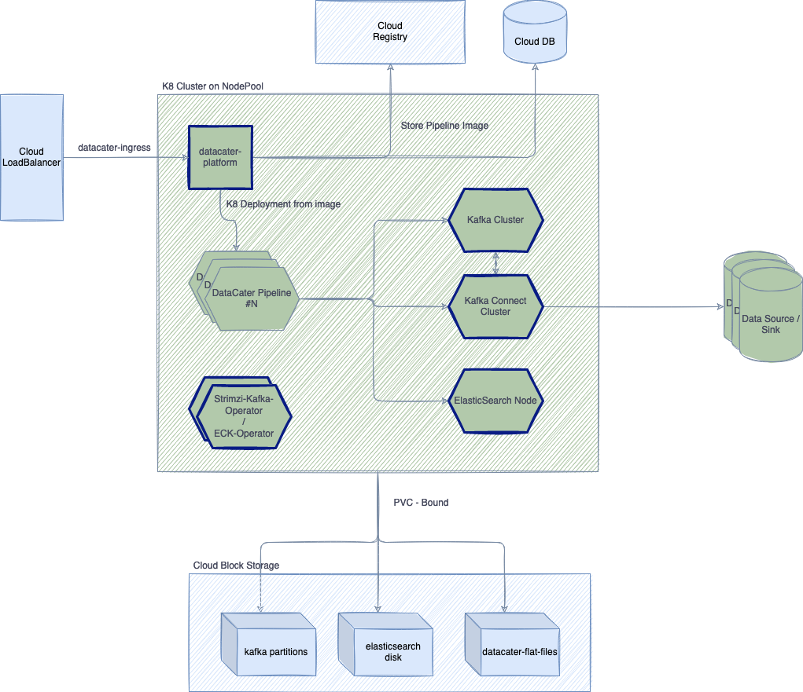

# Helm charts for DataCater
DataCater is the modern, real-time ETL platform for data and dev teams. DataCater helps you
stream data from data sources to data sinks and transform them on the way using our
no-code pipeline designer or Python®.

Go from zero to production in a matter of minutes.

## Repository structure
```
|-- LICENSE
|-- README.md <--- You are here (1)
|-- example-values
`-- gcp-values.yaml <--- Values, which need to be configured for GCP deployments (2)
|-- env.template <--- generally needed datacater variables (3)
`-- gcp       <--- GCP specific helm-chart (4)
    |-- Chart.yaml
    |-- README.md <--- GCP specific installation instructions (5)
    |-- templates
    `-- values.yaml <--- GCP values.yaml (6)
`-- eks <--- EKS specific helm-chart (7)
    |-- Chart.yaml
    |-- README.md <--- EKS specific installation instructions (8)
    |-- templates
    |-- cluster.yaml <--- (9)
    `-- values.yaml <--- EKS values.yaml (10)
```

* (1) Description of DataCater and how to install it.
* (2) Contains settings, which need to be configured by the users of this chart.
* (3) Template for an `.env` file and which environment variables are needed.
* (4) Contains GCP specific manifests and datacater installation on GKE.
* (5) GCP specific guidance on how to set up cluster.
* (6) Reference for configuring DataCater installation on GCP.
* (7) EKS specific helm chart, including manifests and guidance for installation of DataCater in EKS.
* (8) EKS specific installation instructions. Make sure to adjust the cluster.yaml
* (9) Cluster specification for usage by eksctl.
* (10) Default values of datacater helm chart.

## What you will install
The following diagram shows what will be installed by the helm charts in this repository. Boxes with
**<font color="091C84">blue borders</font>** are the resources, which are being installed in the process of following this
document. **Note**, that `datacater-platform` connects to `kafka` and `kafka-connect` as well. Lines are left out
for readability.



## Prerequisites
1. Create a Kubernetes cluster in your desired environment.
You can find examples under `eks/README.md` and `gcp/README.md` respectively.
2. Create or Get your Credentials for a Container Registry, Postgres DB, and Mailing service.
See contents of `env.template` for more information.
3. Install `kubectl` and switch to the context of the newly created cluster.
See [Installation Guide](https://kubernetes.io/docs/tasks/tools/) for how-to.
4. Create Secrets
   Create a `.env` file. Copy the contents of `env.template`. Variables, which need editing are marked with `# TODO:` above
   the according line:
```
# TODO: Required DataCater registry mail
DATACATER_REGISTRY_USER=datacater@example.com
```
After editing accordingly, execute:
```bash
bash create_secrets.sh
```
## Installation of Operators for ElasticSearch and Strimzi

1. Install [strimzi-kafka-operator](https://strimzi.io/) in namespace `datacater`:
```bash
helm repo add strimzi https://strimzi.io/charts/
helm repo update
helm install strimzi-datacater strimzi/strimzi-kafka-operator --version 0.31.1 -n datacater
```
2. Install ECK-Operator
```bash
helm repo add elastic https://helm.elastic.co
helm repo update
helm install elastic-operator elastic/eck-operator -n datacater --set=webhook.enabled=false
```

3. Install Chart with
For GCP use:
```bash
helm upgrade --install -n datacater datacater gcp
```

For EKS use:
```bash
helm upgrade --install -n datacater datacater eks
```
